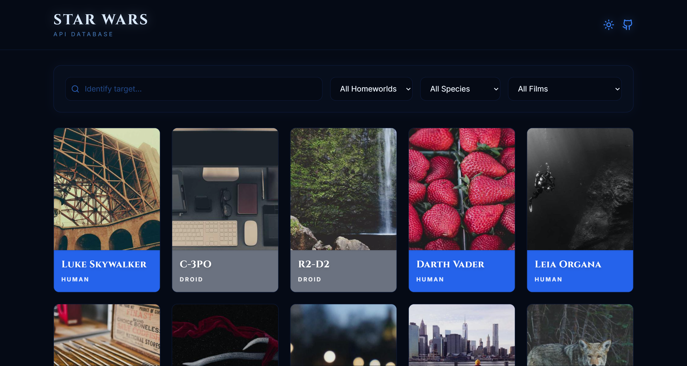
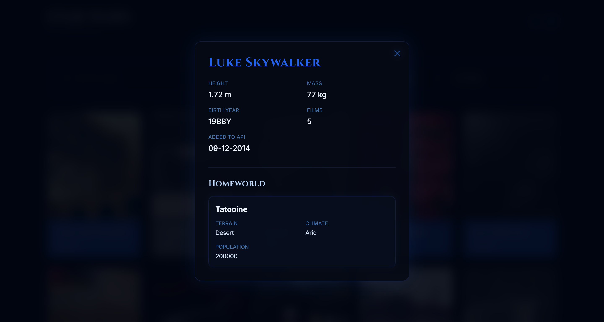
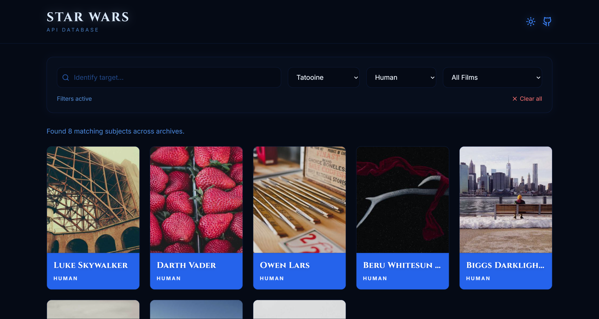
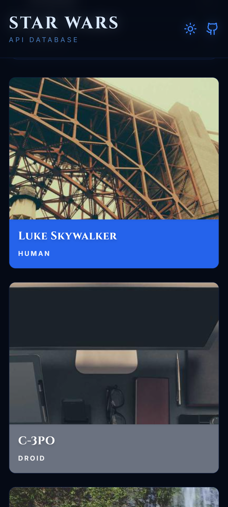
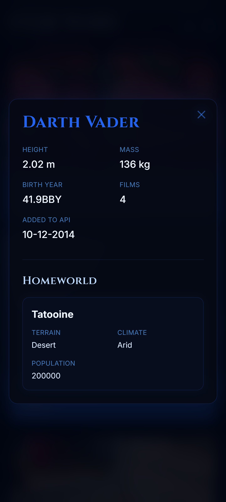
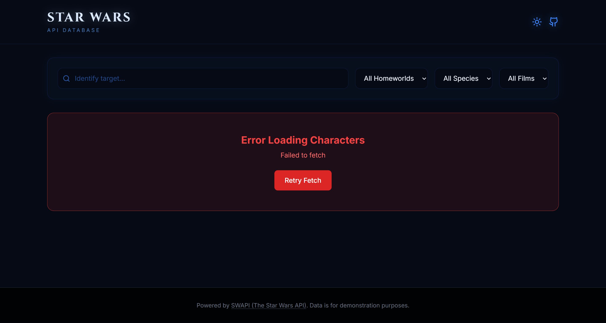

# Star Wars Character Directory

A React + TypeScript application that displays Star Wars characters from the SWAPI API. Features include pagination, search/filtering, detailed modals with lazy-loaded homeworld data, distinct species-based visual styling, robust error handling, and image fallback logic.

## Overview
This is a pure client-side SPA built without a backend server, making direct calls to the public SWAPI API. It demonstrates clean architecture, React Query caching, and Tailwind CSS for responsive, modern styling.

## Tech Stack
- **React 18 + Vite**: Fast scaffolding, quick HMR, and modern tooling.
- **TypeScript**: Ensuring type safety across API responses and components.
- **Tailwind CSS**: For utility-first, highly customizable, and responsive styling.
- **TanStack Query (React Query)**: Used for data fetching, caching, and handling loading/error states cleanly without manual `useEffect` logic.
- **Lucide React**: Beautiful, consistent icons.
- **Vitest + React Testing Library + MSW**: For robust integration testing by mocking API network requests.

## Data Fetching Strategy & Trade-offs
To satisfy the requirements of providing real, API-driven pagination by default, while also enabling a powerful combinable client-side filter (since SWAPI doesn't support complex combinable filters server-side), the app implements a **Dual-Mode Data Fetching Strategy**:
1. **Default Browsing Mode**: The app fetches characters one page at a time (`/people?page=N`). Pagination is handled natively by the API's `next` and `previous` links.
2. **Search/Filter Mode**: When a user begins typing in the search bar or selects a dropdown filter, the app immediately switches to a "Search Mode". It eagerly fetches all 80+ characters across all pages into the React Query cache. This ensures instant and accurate filtering across the entire dataset. The UI correctly indicates that it is "searching all characters" during this operation. Clearing the filters returns the user to normal paginated browsing.
- **Caching**: The `useSpecies` and `usePlanet` queries use the specific SWAPI URLs as their query keys. This ensures automatic deduplication (e.g., if 60 humans are loaded, the app only makes one network request for the Human species).

## Image Fallback
Images are primarily fetched from `starwars-visualguide.com`. If a character image doesn't exist (returns a 404), the app uses a fallback to `picsum.photos` using the character's unique ID as the seed, ensuring the fallback image remains consistent across re-renders.

## Setup Instructions

1. **Install dependencies**
   ```bash
   npm install
   ```

2. **Run the development server**
   ```bash
   npm run dev
   ```

3. **Run tests**
   ```bash
   npm run test
   ```

4. **Build for production**
   ```bash
   npm run build
   ```

## Screenshots

**1. Main Character List (Paginated)**


**2. Character Detail Modal**


**3. Search and Filter**


**4. Mobile View - List**


**5. Mobile View - Modal**


**6. Error State**


> **Note on API Source**: The app defaults to using `swapi.py4e.com` as its primary API base because the original `swapi.dev` has been increasingly unreliable and slow. This mirror maintains the exact same schema. The URL is fully configurable via the `VITE_SWAPI_BASE_URL` environment variable.

## Deployment
The app includes a `netlify.toml` file configured for seamless deployment to Netlify (specifically ensuring client-side routing works correctly via redirects). Connect this repository to your Netlify dashboard for automated deployments.
